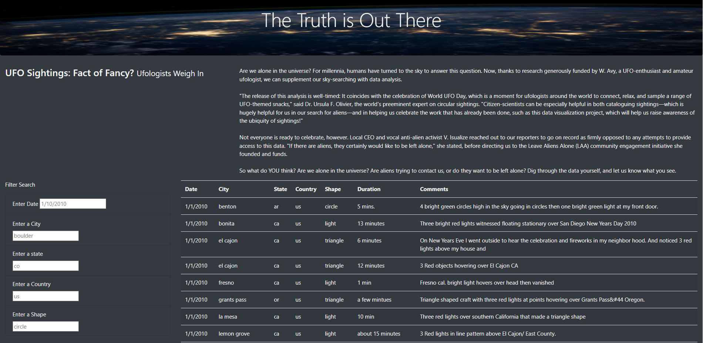

# UFOs
## Overview
Dana has been interested in UFO sightings since she was a child. When she first heard about former Trents’s sighting back in 1950. For this task, the only thing she has to go on so far is a JavaScript file filled to the brim with sightings information. Countries, cities, states, type of sightings, there is a lot in this file. Thankfully, Dana is aware of JavaScript’s visual functionality. It’s a tried-and-true language after all. Her plan is to first use JavaScript to display the data as a table. However, because there is so much data, sifting through it without any adjustments would be a challenge. JavaScript provides a way to manipulative the data by adding filters. It is a little trick to add more than one filters, but Dana is up to the challenge. She’d like to provide a more in-depth analysis of UFO sightings by allowing users to filter for multiple criteria at the same time. In addition to the date, I’ll add table filters for the city, state, country, and shape. Additionally, since I will be posting her article online, Dana wants to put everything together in a tidy HTML page.
## Results

The user is able to use the filters to enter date,city,state,country and shape to match their criteria.
## Summary
One drawback is that user has to be really specific on the words or dates to search because if you use upper case, the results will come to nothing so for that it needs a better design.
A recommendation will be a drop-down option for country, state, city, and shape so it enhance the user experience. Also, a good idea will be to include a button to clear the filters.
